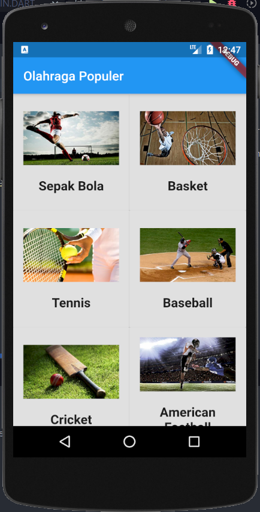
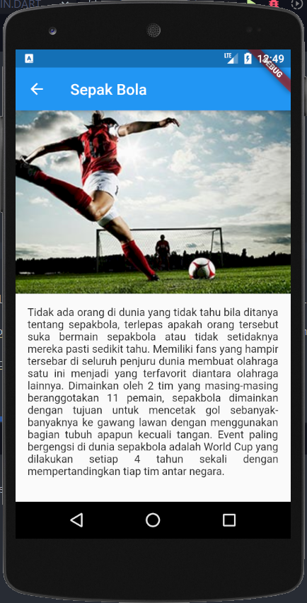

# Aplikasi Olahraga (Tugas 3)

Aplikasi simple yang bertemakan tentang olahraga.

### Screenshot

### Built With
* [Flutter](https://flutter.dev//)
### Materi
* Scrolling WIdget
* Route & Navigation
### Created By
* Mustakim Arianto
### Online Study Group Eudeka!
Salah satu program dari Eudeka! untuk belajar secara full online via Whatsapp/Telegram dan Google Classroom, dengan para praktisi handal di bidangnya. Selain itu juga kamu dapat berkesempatan untuk memperluas koneksimu dengan peserta lain.
### OSG05 - Flutter Basic
Dengan jangka waktu lebih kurang 2 bulan, peserta diharapkan dapat mengenal dan membuat aplikasi simple Flutter dengan menggunakan data dari internet (API).
### Cara Mendaftar Online Study Group
Untuk pendaftaran kelas selanjutnya, silahkan kunjungi atau hubungi kami di bawah ini.
### Info Lebih Lengkap
* Website : www.eudeka.id.
* Twitter: @EudekaID.
* Telegram : @eudekainfo.
* Instagram : @eudeka.id.
* WhatsApp : 0895351577557.
* Email : info@eudeka.id